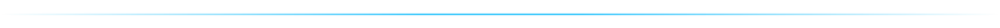

<p align="center">
  <a href="https://gcformat.com/playground.html"></a>
  <a href="https://gcformat.com/guide/benchmarks.html"></a>
  <a href="https://www.nuget.org/packages/BlackwellSystems.Gcf"></a>
  <a href="LICENSE"></a>
</p>

<p align="center">
  
</p>

# gcf-dotnet

.NET implementation of [GCF](https://gcformat.com/), the most token-efficient wire format for LLMs. A drop-in alternative to JSON and TOON for any structured data.

<p align="center">
  
</p>

<p align="center">
  
</p>

**Built for the agentic loop, where the same structured context crosses the model boundary turn after turn.** A single payload is 50-92% smaller than JSON, but GCF also deduplicates repeated structure across turns and sends only deltas when context changes, so by the 5th overlapping call each response costs 99% fewer tokens than JSON, and a 10-call session runs 94.4% cheaper than re-sending JSON every turn. Session dedup and delta both need local IDs and a multi-turn design that neither JSON nor TOON has.

- **100% comprehension on every frontier model**, zero training. 29% fewer tokens than TOON and 56% fewer than JSON across 16 datasets; 91.2% on structurally complex code graphs (vs TOON 68.8%, JSON 54.1%).
- **Proven lossless** across 43,000,000,000+ round-trips in 5 formats and 6 languages. Zero runtime dependencies.
- **One format, four properties no other single format holds at once:** schema-free, lossless, token-compact (50-92% vs JSON), and model-readable with zero training. JSON is verbose, Protobuf needs a schema, MessagePack is binary, and TOON isn't reliably lossless.

2,500+ LLM evaluations. [Full benchmarks](https://gcformat.com/guide/benchmarks.html).

Docs: [gcformat.com](https://gcformat.com/) · [Playground](https://gcformat.com/playground.html) · [GCF vs TOON](https://gcformat.com/guide/vs-toon.html)

## Install

```
dotnet add package BlackwellSystems.Gcf
```

Zero runtime dependencies. Multi-targets `netstandard2.0` and `net8.0`, so it runs on .NET Framework 4.6.1+, Mono, Unity, and modern .NET. Don't want to change code? Use the [MCP proxy](https://github.com/blackwell-systems/gcf-proxy) for zero-code adoption.

## Quick Start

The generic profile encodes any value. The native model is `null`, `bool`, `long`, `double`, `string`, `OrderedMap` (order-preserving object), and `IList` (array).

```csharp
using BlackwellSystems.Gcf;

var data = new OrderedMap {
    ["employees"] = new List<object?> {
        new OrderedMap { ["id"] = 1L, ["name"] = "Alice", ["department"] = "Engineering", ["salary"] = 95000L },
        new OrderedMap { ["id"] = 2L, ["name"] = "Bob",   ["department"] = "Sales",       ["salary"] = 72000L },
    },
};
string output = Gcf.EncodeGeneric(data);
```

Output:
```
## employees [2]{id,name,department,salary}
1|Alice|Engineering|95000
2|Bob|Sales|72000
```

## Graph Profile

```csharp
var payload = new Payload {
    Tool = "context_for_task", TokenBudget = 5000, TokensUsed = 1847,
    Symbols = {
        new Symbol { QualifiedName = "pkg.Auth",   Kind = "function", Score = 0.78, Provenance = "lsp", Distance = 0 },
        new Symbol { QualifiedName = "pkg.Server", Kind = "function", Score = 0.54, Provenance = "lsp", Distance = 1 },
    },
    Edges = { new Edge { Source = "pkg.Server", Target = "pkg.Auth", EdgeType = "calls" } },
};
string output = Gcf.Encode(payload);
```

Output:
```
GCF profile=graph tool=context_for_task budget=5000 tokens=1847 symbols=2 edges=1
## targets
@0 fn pkg.Auth 0.78 lsp
## related
@1 fn pkg.Server 0.54 lsp
## edges [1]
@0<@1 calls
```

## Decode

```csharp
Payload p = Gcf.Decode(input);
Console.WriteLine($"{p.Tool} {p.Symbols.Count} symbols {p.Edges.Count} edges");
```

Throws `DecodeException` on invalid input. `Gcf.Decode(byte[])` / `Gcf.DecodeGeneric(byte[])` decode raw UTF-8 bytes and reject malformed UTF-8 at the byte boundary.

## Session Deduplication

Track transmitted symbols across multiple tool responses. Previously-sent symbols become bare references instead of full declarations:

```csharp
var session = new Session();

string out1 = Gcf.EncodeWithSession(payload1, session); // full declarations
string out2 = Gcf.EncodeWithSession(payload2, session); // reused symbols as "@N  # previously transmitted"
```

By the 5th call in a session: 86% fewer tokens than JSON from dedup alone, 99% stacked with delta encoding.

## Streaming Encode

Write GCF output incrementally as symbols and edges arrive. Zero buffering, O(1) memory per row:

```csharp
var enc = new StreamEncoder(writer, "context_for_task", new StreamOptions { TokenBudget = 5000 });

enc.WriteSymbol(new Symbol { QualifiedName = "pkg.Auth", Kind = "function", Score = 0.95, Provenance = "lsp", Distance = 0 });
enc.WriteEdge(new Edge { Source = "pkg.Server", Target = "pkg.Auth", EdgeType = "calls" });
enc.Close(); // emits ##! summary trailer
```

Output uses `[?]` deferred counts and a `##! summary` trailer. Standard `Gcf.Decode` handles streaming output with no changes.

## Delta Encoding

When the consumer already has a prior context pack, send only what changed:

```csharp
var delta = new DeltaPayload {
    Tool = "context_for_task",
    BaseRoot = "aaa111",
    NewRoot = "bbb222",
    Removed = { new Symbol { QualifiedName = "pkg.OldFunc", Kind = "function" } },
    Added   = { new Symbol { QualifiedName = "pkg.NewFunc", Kind = "function", Score = 0.85, Provenance = "rwr" } },
    DeltaTokens = 30,
    FullTokens = 200,
};
string output = Gcf.EncodeDelta(delta);
```

81.2% savings on re-queries where the pack changed slightly.

## Generic Encoding

Encode any value (not just graph payloads) into GCF tabular format. Arrays of uniform maps get tabular rows; nested maps use `## key` section headers. See the Quick Start above.

## Generic-Profile Delta (multi-turn)

In an agent loop the same keyed table gets re-queried turn after turn. Instead of re-sending the whole table each time, send only the changed rows (SPEC §10a):

```csharp
var baseSet = new GenericSet("id", new[] { "id", "status" }, new[] {
    new OrderedMap { ["id"] = 1001L, ["status"] = "pending" },
    new OrderedMap { ["id"] = 1002L, ["status"] = "shipped" },
});
var next = new GenericSet("id", new[] { "id", "status" }, new[] {
    new OrderedMap { ["id"] = 1001L, ["status"] = "shipped" },   // changed
    new OrderedMap { ["id"] = 1003L, ["status"] = "pending" },   // added (1002 removed)
});

var d = Gcf.DiffGenericSets(baseSet, next);                 // the blessed producer path
string wire = Gcf.EncodeGenericDelta(d);                    // ## added / ## changed / ## removed
var held = Gcf.VerifyGenericDelta(baseSet, d, d.NewRoot);   // atomic apply + new_root verification
```

Opt-in and bilateral, keyed on content-addressed pack roots. By the 5th overlapping call, ~97% fewer tokens than re-sending JSON. Byte-for-byte interoperable with the Go, Python, TypeScript, Rust, Swift, and Kotlin SDKs.

### Re-anchor session helper

`GenericDeltaSession` manages the delta/re-anchor cadence for you: each `Next` returns either a compact delta or, on its cadence, a full re-anchor (which re-grounds the consumer), updating its held base.

```csharp
var sess = new GenericDeltaSession(baseSet, "orders", ReanchorPolicy.SizeGuard());
string establish = sess.CurrentFull();          // transmit the base once to establish it
foreach (var snapshot in stream) {              // each turn's current GenericSet
    var (wire, isFull) = sess.Next(snapshot);   // a compact delta, or a periodic full re-anchor
}
```

`ReanchorPolicy.FixedN(15)` re-anchors every N turns; `ReanchorPolicy.SizeGuard()` (recommended) re-anchors once the cumulative delta reaches a full payload's size. It introduces no new wire syntax and the decoder stays cadence-agnostic, so a re-anchor is just the protocol's "full" outcome on a schedule. A schema change forces a full (§10a.7).

## API

| Member | Description |
|--------|-------------|
| `Gcf.Encode(Payload)` | Encode a graph payload to GCF text |
| `Gcf.EncodeGeneric(object?)` | Encode any value to GCF tabular format |
| `Gcf.Decode(string)` / `Gcf.Decode(byte[])` | Parse graph GCF text (or strict-UTF-8 bytes) to a `Payload` |
| `Gcf.DecodeGeneric(string)` / `Gcf.DecodeGeneric(byte[])` | Decode generic (or graph) profile to the native value model |
| `Gcf.EncodeWithSession(Payload, Session?)` | Encode with session deduplication |
| `Gcf.EncodeDelta(DeltaPayload)` / `Gcf.DecodeDelta(string)` | Graph delta wire (added/removed) |
| `Gcf.DiffGenericSets(GenericSet, GenericSet)` | Diff two keyed record sets (generic profile) |
| `Gcf.EncodeGenericDelta(...)` / `Gcf.DecodeGenericDelta(...)` | Generic-profile delta wire (§10a) |
| `Gcf.VerifyGenericDelta(...)` | Atomic apply + `new_root` verification |
| `Gcf.GenericPackRoot(GenericSet)` / `Gcf.PackRoot(symbols, edges)` | Content-addressed SHA-256 pack roots |
| `new GenericDeltaSession(base, tool, policy)` | Producer-side re-anchor cadence helper (§10a.8) |
| `new Session()` | Thread-safe tracker for multi-call deduplication |
| `new StreamEncoder(writer, tool, options)` | Incremental graph streaming encoder |

## Types

| Type | Purpose |
|------|---------|
| `Payload` | Full GCF payload: tool, budget, symbols, edges, pack root |
| `Symbol` | Graph node: qualified name, kind, score, provenance, distance |
| `Edge` | Directed relationship: source, target, edge type |
| `DeltaPayload` | Diff between two graph packs: added/removed symbols and edges |
| `GenericSet` / `GenericDeltaPayload` | Keyed record set and its generic-profile diff (§10a) |
| `GenericDeltaSession` | Stateful producer that schedules delta vs full re-anchor (§10a.8) |
| `ReanchorPolicy` | Re-anchor cadence: `FixedN(n)` or `SizeGuard()` |
| `Session` | Thread-safe tracker for multi-call deduplication |
| `OrderedMap` | Order-preserving object in the native value model |
| `DecodeException` | Thrown on invalid GCF input |

## Benchmarks

2,500+ LLM evaluations across 11 models, 4 providers, and 50+ independent test runs.

| | GCF | TOON | JSON |
|---|---|---|---|
| **Comprehension** (23 runs, 10 models) | **91.2%** | 68.8% | 54.1% |
| **Generation** (28 runs, 9 models) | **5/5** | 1.0/5 | 5.0/5 |
| **Input tokens** (500 symbols) | **11,090** | 16,378 | 53,341 |
| **Output tokens** (100 symbols) | **5,976** | 8,937 | 16,121 |

GCF wins 15/16 datasets on the expanded [token efficiency benchmark](https://github.com/blackwell-systems/toon/tree/gcf-comparison). Full results: [gcformat.com/guide/benchmarks](https://gcformat.com/guide/benchmarks.html)

## Implementations

| Language | Package | Repository |
|----------|---------|-----------|
| Go | `go get github.com/blackwell-systems/gcf-go` | [gcf-go](https://github.com/blackwell-systems/gcf-go) |
| TypeScript | `npm install @blackwell-systems/gcf` | [gcf-typescript](https://github.com/blackwell-systems/gcf-typescript) |
| Python | `pip install gcf-python` | [gcf-python](https://github.com/blackwell-systems/gcf-python) |
| Rust | `cargo add gcf` | [gcf-rust](https://github.com/blackwell-systems/gcf-rust) |
| Swift | Swift Package Manager | [gcf-swift](https://github.com/blackwell-systems/gcf-swift) |
| Kotlin | JitPack | [gcf-kotlin](https://github.com/blackwell-systems/gcf-kotlin) |
| .NET | `dotnet add package BlackwellSystems.Gcf` | [gcf-dotnet](https://github.com/blackwell-systems/gcf-dotnet) |
| MCP Proxy | `pip install gcf-proxy` | [gcf-proxy](https://github.com/blackwell-systems/gcf-proxy) (bidirectional, session dedup, HTTP frontend) |

**Zero runtime dependencies. Permanently.** Every implementation depends only on its language's standard library. No transitive dependencies. No supply chain risk. This is a permanent commitment: GCF will never take on external runtime dependencies. MIT licensed. All implementations support both the generic profile (`EncodeGeneric`) and the graph profile (`Encode`).

**Specification:** [SPEC v3.5.0 Stable](https://github.com/blackwell-systems/gcf/blob/main/SPEC.md) with 265 conformance fixtures, 43,000,000,000+ lossless round-trips verified across 5 formats and 6 languages. Cross-language conformance verified.

## License

MIT - [Dayna Blackwell](https://github.com/blackwell-systems)
